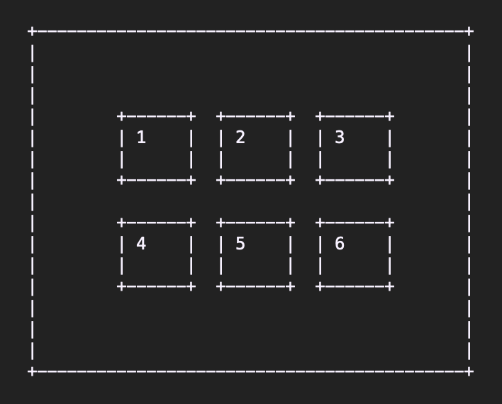

# amuse-test

# (주) 어뮤즈트래블 코딩 과제물  
안녕하세요, 지원자 이성재입니다.  

어뮤즈트래블 에서 요청하신 코딩 과제물입니다.  

Nuxt.js 로 작업 하였으며, vue-gallery와 Bootstrap-vue 를 사용하였습니다.  

## 설치  
1. 리포를 복제하세요  
```
npm i
```
참고: Vue.js.2.6.12 

## 사용  
1. 앱을 실행합니다  
```
npm run dev
```
2. 과제물은 상단에 "과제물' 링크를 클릭하세요  

## 요청하신 사항  
레이아웃  
  

#### [코딩과제물 설명]  

1. 화면 정중앙에 6개의 이미지를 첨부 이미지와 같이 배치합니다.  
​
2. 6개의 이미지 중 하나를 클릭하면 해당 이미지가 확대되면서 (gallery) 형태로 이미지를 rotation 해서 볼 수 있도록 합니다. 단, 이때 6개의 이미지 중 클릭한 이미지가 가장 먼저 화면에 보여져야 합니다.  
​
  (ex. 사용자가 3번 이미지를 클릭했다면 3번 이미지부터,  3 => 4 => 5 => 6 => 1 => 2 => 3 => 4... 순으로 로테이션 되고. 만일, 사용자가 5번 이미지를 클릭했다면 5번 이미지 부터 로테이션 되도록.)  
​
3. Don't reinvent the wheel! VueJS 용 다양한 gallery / lightbox / carousel 오픈소스들 중 하나를 찾아서 dependency 로 사용하세요.  
​
  (참고. 저희는 vue-gallery 를 사용했습니다.)
​
#### [코딩과제물 필수요건]  
​
- 반드시 vue CLI 나 nuxt 로 스캐폴딩후 작업한 결과물이어야 하며, `npm run dev` 와 같이 앱의 실행 방법을 작성한 문서파일을 만들어 README.doc 이란 이름으로 소스코드 root 디렉토리에 포함해주세요.  
​
- 중복 코드나 불필요한 주석문들을 포함하여 작업하다만것 같은 느낌의 코드를 제출하는 분들도 계십니다. 가급적 코딩 스타일에도 신경 써주세요.  
​
#### [개별질문 내용]  
​
1. React 에서 상태관리를 어떻게 하였으며, 해당 상태관리의 장점과 단점은 무엇인가요?  
​답: React 상태 관리는 React Hook 으로 했습니다. React 에서 기본적으로 주는 useState, useEffect, useContext를 사용했습니다.  
장점: 배우기 편했습니다. 이해하기도 쉽고 redux보다 가볍고 간단하다는 생각이 듭니다.  
단점: 앱에 기능들이 추가되고 규모가 커질수록 정리하기도, 관리하기도 조금 힘들었습니다.  유저정보, 유저가 입력한 정보, 그 정보를 연산한 정보 세가지  정보들만 사용했었는데, 상태 규모가 커지고 이해할 수 없는 버그들도 많이 생겼습니다.  
2. 개발 환경이나 배포 설정 시, Docker 를 사용한 경험이 있다면, 해당 use case 를 간단히 설명해 주세요.  
답: Docker는 사용한 경험이 없습니다  

### 문제점  
* 레이아웃을 완벽히 소화하지 못했습니다  
"화면 정 중앙에" 라고 하시고 이미지들 좌우에 margin이 있는데, 도무지 이뤄내기 힘들더군요. 시간을 오래 두고 연구하면 이뤄낼 수 있지만, 지금 단계에선 구현하지 못했습니다  
* Vuetify 를 사용하신다고 해서 열심히 알아봤습니다. 설치조차 안됩니다. 
Vuetify의 GitHub를 찾아보니 최신 버젼으로 업데이트가 안된다고 나옵니다. (issue #403) 
npm 패키지는 9개월동안 업데이트가 없고, 이슈들도 68개나 오픈되어 있으니, vuetify는 지금 공사중인 듯 합니다  
* Nuxt.js 는 아직 Vue 2 를 사용하고 있습니다. 곧 Vue 3로 갈아탈 것 같은데, 이번 프로젝트는 "up to date" 이라 보기는 힘들것 같습니다.  
* 아직 Vue.js 도 Nuxt.js 도 완벽히 이해한 것이 아닙니다. 과제물 구현만 했을 뿐, 구체적인 내용은 아직 학습중입니다  

### Development  
* fix layout to match the wireframe  
* vuetify when it becomes available  
* implement Vue 3  
* implement Vue 3 cli instead of Nuxt.js - maybe  
* 0 state management  
* implement backend  
​